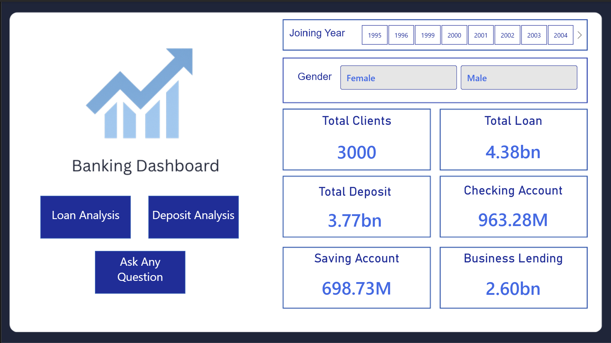

# Banking Analytics Dashboard

A comprehensive **Banking Analytics Dashboard** built using **Microsoft Power BI** to analyze banking performance, customer accounts, loans, deposits, and risk-related metrics.

The dashboard provides an interactive and user-friendly interface that enables users to explore key banking KPIs and analyze loan and deposit performance across different dimensions such as **bank relationship, gender, income band, nationality, account type, and risk weighting**.

---

## Dashboard Overview

The Banking Analytics Dashboard consists of three main sections:

- **Overview**
- **Deposit Analysis**
- **Loan Analysis**

Users can interact with different filters and slicers to dynamically analyze banking data and gain meaningful business insights.

---

## Overview Dashboard

The Overview page provides a high-level summary of the bank's overall performance.

### Key KPIs

- **Total Clients:** 3,000
- **Total Loan:** 4.38bn
- **Total Deposit:** 3.77bn
- **Checking Account:** 963.28M
- **Saving Account:** 698.73M
- **Business Lending:** 2.60bn

### Features

- Joining Year filter
- Gender filter
- Total Clients analysis
- Total Loan analysis
- Total Deposit analysis
- Checking Account analysis
- Saving Account analysis
- Business Lending analysis
- Navigation to Loan Analysis
- Navigation to Deposit Analysis
- Ask Any Question feature

---

## Deposit Analysis

The Deposit Analysis page focuses on understanding customer deposits and account performance.

### Key KPIs

- **Total Deposit:** 3.77bn
- **Average Deposit Amount:** 418.48
- **Checking Accounts:** 963.28M
- **Deposit-to-Loan Ratio:** 0.86

### Analysis Performed

- Deposit by Account Type
- Deposit by Nationality
- Deposit by Income Band
- Deposit trends over Joining Year
- Bank Relationship analysis
- Gender-based analysis
- Income Band analysis

### Deposit Insights

The dashboard enables users to identify:

- Which account types contribute the highest deposits
- Deposit contribution across different nationalities
- Deposit distribution among income groups
- Deposit trends over time
- Relationship between deposits and loans

---

## Loan Analysis

The Loan Analysis page provides insights into the bank's loan portfolio and lending performance.

### Key KPIs

- **Total Loan:** 2.19bn
- **Bank Loan:** 876.24M
- **Business Lending:** 1.31bn
- **CC Balance:** 4.80M

### Analysis Performed

- Bank Loan by Income Band
- Bank Loan by Risk Weighting
- Bank Loan by Bank Relationship
- Bank Loan by Nationality
- Gender-based loan analysis
- Joining Year analysis

### Loan Insights

The dashboard helps users understand:

- Loan distribution across different income groups
- Loan exposure based on risk weighting
- Lending performance across bank relationships
- Loan contribution by nationality
- Business lending performance
- Credit card balance trends

---

## Business Questions Answered

This dashboard helps answer important banking business questions such as:

1. What is the total deposit and total loan portfolio?
2. Which account type contributes the highest deposit amount?
3. Which bank relationship contributes the highest loans?
4. How are deposits distributed across different income bands?
5. Which nationality contributes the highest deposits?
6. Which nationality contributes the highest loan amount?
7. How does loan distribution vary based on risk weighting?
8. What is the deposit-to-loan ratio?
9. How does banking performance change over different joining years?
10. How do gender and income bands affect loan and deposit performance?
11. How much business lending does the bank have?
12. Which customer segments contribute the most to the bank's deposits and loans?

---

## Tools & Technologies

- **Microsoft Power BI** – Dashboard development and data visualization
- **Power Query** – Data cleaning and transformation
- **DAX** – KPI calculations and analytical measures
- **Data Visualization** – Interactive charts, KPI cards, slicers, and navigation buttons

---

## Key Dashboard Features

- Interactive dashboard navigation
- Dynamic slicers and filters
- KPI cards for important banking metrics
- Drill-down analysis
- Year-based analysis
- Gender-based analysis
- Income band segmentation
- Bank relationship analysis
- Nationality-based analysis
- Risk weighting analysis
- Deposit and loan trend analysis
- Interactive report navigation

---

## Dashboard Pages

### 1. Overview

Provides an overall summary of banking performance and key metrics.

### 2. Deposit Analysis

Analyzes deposits based on account type, nationality, income band, bank relationship, gender, and joining year.

### 3. Loan Analysis

Analyzes loans based on income band, risk weighting, nationality, bank relationship, gender, and joining year.

---

## Dashboard Preview

### Overview

### Deposit Analysis

### Loan Analysis

---

## Project Objective

The main objective of this project is to build an interactive banking analytics solution that transforms raw banking data into meaningful visual insights. The dashboard helps stakeholders monitor key performance indicators, understand customer behavior, analyze lending and deposit patterns, and identify important trends across different customer segments.

---

## Key Learnings

Through this project, I gained practical experience in:

- Building interactive dashboards using Power BI
- Creating business-focused KPIs
- Designing professional dashboard layouts
- Creating interactive slicers and filters
- Developing DAX measures
- Analyzing banking and financial data
- Performing customer segmentation
- Creating navigation between report pages
- Presenting complex data through simple visualizations
- Converting business requirements into analytical dashboards

---

## Author

**Mohan Sivakumar Maguluri**

Aspiring Data Analyst passionate about transforming data into actionable business insights using **SQL, Python, Excel, Power BI, and Tableau**.

---

